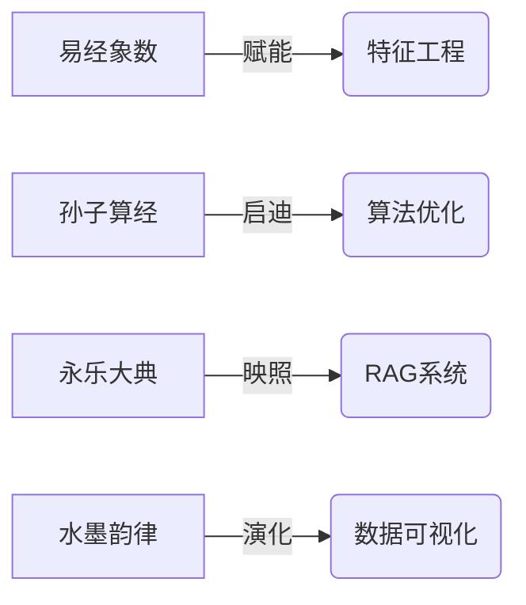

---
# the default layout is 'page'
icon: fas fa-info-circle
order: 4
---

# 𝕵𝖎𝖓𝖌𝖍𝖚𝖆 静华 · 墨数阁  
#### 𝔏𝔞𝔫𝔤ℭ𝔥𝔞𝔦𝔫 𝔇𝔢𝔳 灵链探幽 · 数海钩沉

---

## ◈ 渊渟岳峙 ◈

> _"观天之道，执天之行，尽矣"_ —— 《阴符经》

某乃数字江湖一散人，左手执《算经》以溯九天星轨，右手握灵钥以启万物智识。游走于**Python琼林**，采撷数据之芳华；潜修于**LangChain秘境**，锻造智能之玄兵。好以代码为墨，算法为砚，在硅基世界中续写河图洛书之传奇。

---

## ◈ 术法精要 ◈

♢ **数道玄机**  
`Pandas·Numpy·Matplotlib`  
建数塔以观星象，绘云图而察秋毫，于混沌中见大千秩序

♢ **灵链秘钥**  
`LangChain·LLM·RAG`  
炼字成丹，铸文为剑，教机器识得平仄风骨，令代码通晓墨韵玄机

♢ **古法新酿**  
`Jinja2·Streamlit·Taipy`  
借Web之舟楫，载算法之清辉，筑琼楼于比特之海

---

## ◈ 问道录 ◈

---

## ◈ 道法自然 ◈

> _「易有太极，是生两仪」_ —— 《周易·系辞》

深信**阴阳相济**乃数字修行之本：
- 刚极：`assert 1 + 1 == 2` 的代码铁律
- 柔极：`诗意 * 逻辑 = 优雅解` 的算法禅意
- 妙境：在`try...except`的浮沉中参悟「知白守黑」之道

---

## ◈ 墨客邀约 ◈

[![蜀笺]](https://img.icons8.com/color/48/000000/scroll--v1.png) 诚邀诸君：  
共研**数字周易**，同修**算法丹道**  
煮字为药，铸码成钟，于红尘代码中觅见太初之道  

---
{: .prompt-tip }
